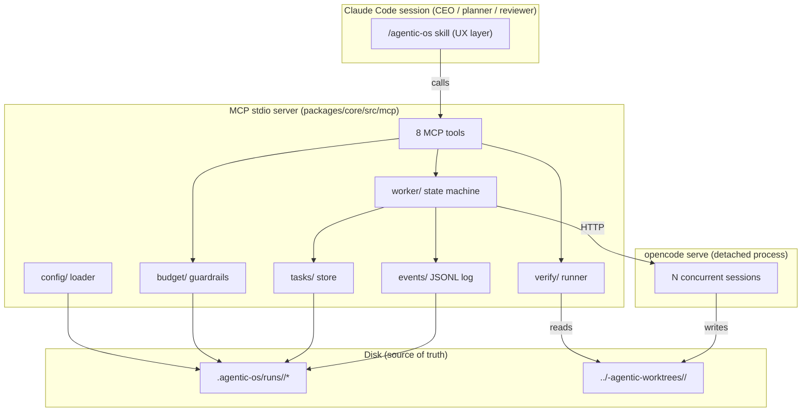
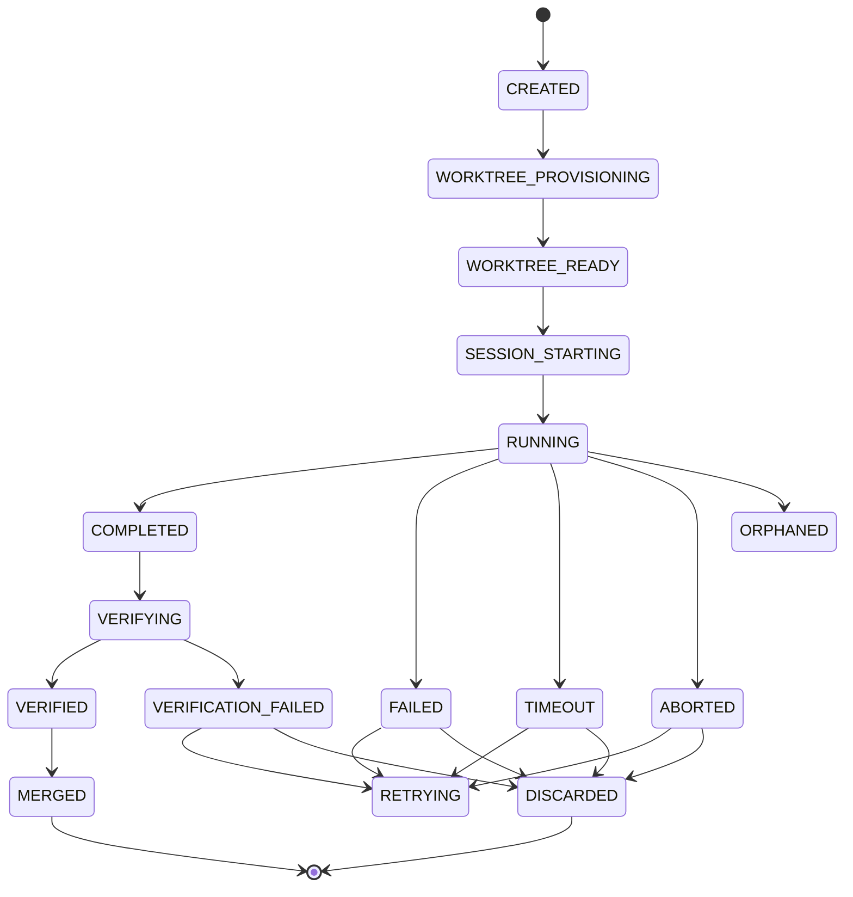
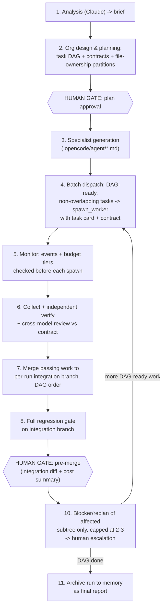

# Agentic OS — Architecture

## Overview & goals

Agentic OS turns a single objective — e.g. "Build an AI CRM with OAuth,
Stripe, Docker, PostgreSQL and CI/CD" — into a completed software project
autonomously: analyze → design org → generate specialists → launch isolated
OpenCode workers → parallel dev → shared memory → continuous review →
auto-testing → blocker detection → replan → repeat.

Claude Code is CEO, architect, planner, and reviewer. It must never become
the bottleneck and must never write implementation code itself. OpenCode
CLI provides the implementation workers — short-lived agents, each spawned
into its own git worktree, each held to a contract, each independently
verified before its work is trusted.

Milestone 1's concrete goal is narrower than the full platform: give Claude
Code the ability to spawn OpenCode agents and use them properly — spawn,
monitor, verify, merge — as MCP tools backed by a durable, disk-resident
core library.

**Form factor.** The core engine ships as a standalone TypeScript library
plus a local stdio MCP server, packaged as a Claude Code plugin (skills are
the UX layer). A standalone daemon reusing the same core via the Claude
Agent SDK is a later milestone (M4).

**Autonomy default.** Human gates sit at plan-approval and pre-merge, plus
a hard per-run budget ceiling. Everything between gates runs unattended.

## Design principles

### Hierarchy is data, not processes

The org hierarchy a run implies — CEO → EM → domain leads → specialists →
reviewers → integration — is **generated per project as a plan artifact**
(org chart + task-DAG ownership), not instantiated as always-on manager LLM
processes. Prior-art measurements (CrewAI-style manager/worker setups) show
live manager layers multiply token cost at every hop without adding
measurable correctness, and a "single lead" becomes a bottleneck under real
parallelism. Agentic OS keeps exactly one live lead: Claude Code plays
CEO/planner/EM in-session; domain leads/reviewers materialize as scoped
Claude subagents only when a phase needs one; specialists materialize as
generated OpenCode agent files consumed by workers. The hierarchy is real —
written down, versioned, inspectable — it just isn't a standing process
tree. This is flagged to the founder at each plan-approval gate as a design
choice, not an oversight.

### Disk is source of truth

The MCP server process is a cache, not the record. Worker state, events,
and cost figures are written to disk (JSONL logs, JSON snapshots) before
they're considered real; on start (including after a crash) the in-memory
worker registry is rebuilt entirely from disk. This follows directly from
the environment constraint that an MCP stdio server is **not
auto-restarted on crash** — if state lived only in the process, a crash
would silently orphan every in-flight worker with no way to recover them.

### Verification never trusts self-report

OpenCode workers report their own completion status, but that report is a
hint, never truth. `verify/` is the only component that can mark a worker
`VERIFIED`, and it does so by running real shell commands (build, test,
lint) against the actual worktree diff on disk — never by reading the
worker's transcript. This defends directly against known OpenCode
headless-mode signaling bugs (premature exit, "session not found" races)
and against reviewer rubber-stamping in general: if the only evidence is
what the worker says about itself, a confidently wrong worker and a correct
one look identical.

### Structured artifacts, not transcript sharing

Work handed between phases — task cards, contracts, file-ownership
partitions, verification results, cost summaries — is passed as typed,
schema-validated JSON artifacts, never raw conversation transcript.
Transcripts are large and unstructured and force every downstream consumer
to re-parse intent the upstream step already knew precisely. Structured
handoff keeps context bundles small (bounded by
`memory.maxContextTokensPerHandoff`), keeps the audit trail diffable, and
means a reviewer reads a diff stat and a contract, not a 40-turn
back-and-forth.

## Modules

All modules live under `packages/core/src/`. The tag marks when a module is
first built; several grow further capability in later milestones.

| Module | Responsibility | Milestone |
|---|---|---|
| `config/` | YAML load + validate (zod), env interpolation, `resolveModelRoute(taskType)` | M1 |
| `worktree/` | git worktree create/list/remove via `child_process`, Windows-safe | M1 |
| `opencode-client/` | Typed wrapper over the `opencode serve` HTTP API; spawns `serve` detached | M1 |
| `worker/` | Worker state machine, infra/logic failure classification, retry policy — client injected/mockable | M1 |
| `events/` | Append-only JSONL event log per run/worker, `append`/`tail` | M1 |
| `tasks/` | Task record store (M1) → DAG + file-ownership batch selection (M2) | M1/M2 |
| `budget/` | Cost accumulation, pre-spawn reservation, tiered guardrails | M1 |
| `verify/` | Independent verification runner (shell commands in worktree) → cross-model review (M3) | M1 |
| `mcp/` | Stdio MCP server wiring the 8-tool surface | M1 |
| `memory/` | Shared project memory: decisions, contracts, facts, context bundles per handoff | M2 |
| `specialist/` | Generate/retire `.opencode/agent/*.md` from plan roles | M3 |
| `plugin/` | Extension points: custom verifiers, archetypes, providers | M4 |

## Component diagram



## Worker lifecycle



### Infra vs. logic failure classification

Every terminal-ish failure is classified into exactly one bucket, because
the two demand opposite handling:

- **Infra failure** — auto-retried with backoff (2s/8s/30s, max 3), does
  **not** consume replan budget. Examples: git/worktree errors, `opencode
  serve` unreachable, HTTP errors, a stream dropping with zero assistant
  events, a process exit with no diff produced. These are
  environment/process problems; the same prompt run again may just work.
- **Logic failure** — counts against the replan cap, never blindly
  retried with the same prompt. Examples: verification fails, turn budget
  exhausted, diff violates its file-ownership partition. Handled by a
  *new* task card, not a resubmission of the identical prompt.

**Classification rule:** signals observed at the HTTP/process layer are
infra; anything judged from the worktree diff or test output is logic.
`verify/` is the only truth for "did it work" — this split exists because a
crashed process and a wrong implementation look similar to a naive retry
loop, and conflating them either burns replan budget on transient noise or
blindly retries a genuinely wrong approach.

## Execution pipeline



1. **Analysis** (Claude) → brief.
2. **Org design & planning** → task DAG + contracts + file-ownership
   partitions produced together, then gated. **HUMAN GATE: plan approval.**
3. **Specialist generation** → `.opencode/agent/*.md` files for plan roles.
4. **Batch dispatch** → DAG-ready, non-overlapping tasks → `spawn_worker`
   with task card + contract (structured handoff).
5. **Monitor** → events + budget tiers checked before each spawn (soft →
   downgrade model, hard → halt).
6. **Collect + verify** → independent verification, plus cross-model
   review vs. contract from M3.
7. **Merge** → passing work merges to a per-run integration branch in DAG
   order; the orchestrator owns merge order, not the workers.
8. **Full regression gate** on the integration branch as a whole.
9. **HUMAN GATE: pre-merge** — integration diff + cost summary reviewed.
10. **Replan** — blockers trigger replan scoped to only the affected
    subtree, capped at 2–3 iterations → mandatory human escalation.
11. **Repeat** 4–10 until the DAG is done, then archive the run to memory
    as a final report.

## State & persistence

- **Disk is source of truth; the MCP process is a cache.** The MCP server
  rebuilds its worker registry from disk on every start, including after
  a crash.
- **JSONL event logs + JSON snapshots, atomic (temp-file + rename), for
  M1 — not SQLite.** A native SQLite module (or Node's still flag-gated
  `node:sqlite` on this Node 22 minor) is real risk on Windows for no M1
  payoff; JSONL survives torn writes and is human-diffable during
  development. SQLite is revisited for M2 only if DAG queries demand
  relational access JSONL can't reasonably serve.
- **`opencode serve` runs detached** (`spawn({detached:true})` +
  `.unref()`), PID + port recorded in `.agentic-os/server.json`. This
  decouples worker liveness from the Claude Code / MCP process: a crash or
  restart of Claude Code does not kill running workers.
- **Crash reconciliation.** On MCP restart: probe the recorded PID
  (`process.kill(pid, 0)` — verified to work as a liveness check on
  Windows), confirm the server responds via `GET /global/health`, then
  reconcile previously `RUNNING` workers against live OpenCode session
  status. If `serve` is gone, every `RUNNING` worker is marked `ORPHANED`
  — infra-classified, since a dead server says nothing about whether the
  worker's approach was right.
- **Live-verified API facts (opencode 1.15.13, from `GET /doc`):** sync
  prompt is a long-lived blocking `POST /session/{id}/message`; session
  busy/idle state comes from `GET /session/status`, a map that omits idle
  sessions entirely; `Session` objects carry `cost`/`tokens`/`summary`
  directly. Full discovery notes:
  `packages/core/src/opencode-client/docs-notes.md`.

## MCP tool surface (M1, 8 tools)

| Tool | Signature | Purpose |
|---|---|---|
| `spawn_worker` | `(taskId, prompt, baseBranch?, agentId?, model?) -> {workerId, worktreePath, sessionId}` | Provision a worktree, start a session, begin a worker's lifecycle |
| `worker_status` | `(workerId \| "all") -> {state, lastEventAt, costUsd, tokens, headline}` | Poll one or all workers' current state |
| `list_workers` | `(filter?) -> WorkerSummary[]` | Enumerate workers, optionally filtered |
| `stream_worker_log` | `(workerId, sinceSeq?) -> Event[]` | Poll new events; `monitors.json` also tails `events.jsonl` for push delivery |
| `abort_worker` | `(workerId, reason) -> {state}` | Terminate a running worker (Windows: `taskkill /T /F`) |
| `collect_worker` | `(workerId) -> {filesChanged, diffStat, cost, transcriptExcerpt}` | Pull a structured summary of a worker's output |
| `verify_worker` | `(workerId, command?) -> {passed, exitCode, output}` | Run independent verification against the worker's worktree |
| `finalize_worker` | `(workerId, action:"merge"\|"discard", targetBranch?) -> {result, conflict?}` | Merge verified work or discard it |

## Directory layouts

**Platform repo** (`F:\Agentic_os\`):

```
packages/core/src/{config,worktree,opencode-client,worker,events,tasks,
                    budget,verify,mcp,memory,specialist,plugin}/
packages/core/test/
packages/plugin/{.claude-plugin/plugin.json, .mcp.json, skills/, agents/,
                  monitors/monitors.json, bin/}
config/{orchestrator,models,agents,memory,providers}.yaml   # shipped defaults
docs/ARCHITECTURE.md  docs/decisions/
package.json (npm workspaces), tsconfig.base.json
```

**Target project runtime** (`<project>\.agentic-os\`, gitignored):

```
config/                          # overrides of shipped defaults
server.json                      # opencode serve PID + port
runs/<runId>/
  plan.json  task-board.json  contracts/
  workers/<workerId>/{meta.json, events.jsonl, verify/}
  cost.json  events.jsonl
memory/{decisions.jsonl, facts.json}
logs/
```

**Worktrees** live **outside** the target project entirely:
`..\<project>-agentic-worktrees\<runId>\<workerId8>` — avoids nested-repo
confusion and sidesteps Windows `MAX_PATH` issues by keeping the target
project's own path prefix out of the worktree path.

## Config

Five shipped YAML files under `config/`, each overridable per target
project in `<project>\.agentic-os\config\`:

- **`providers.yaml`** — provider defs; only `apiKeyEnv` **names** are
  stored, never literal keys; also `opencode_binary_path`.
- **`models.yaml`** — `routing.<taskType> -> "provider/model"`,
  `routing.default`, `downgrade_on_soft_cap`, `small_model`. The planner
  tags each task card with a `taskType`; `resolveModelRoute` maps it to a
  provider/model string passed through unmodified. No provider names in
  code — only in config.

  ```yaml
  routing:
    default: "anthropic/claude-sonnet"
    implementation: "opencode/grok-code"
    search: "anthropic/claude-haiku"
  downgrade_on_soft_cap: "small_model"
  small_model: "anthropic/claude-haiku"
  ```

- **`agents.yaml`** — specialist `archetypes[]`, `default_permission`
  (safety floor: deny `git push` and deploys regardless of overrides),
  `max_concurrent_specialists`.
- **`memory.yaml`** — `store`, `retention`, `maxContextTokensPerHandoff`,
  summarization model.
- **`orchestrator.yaml`** — budget caps, replan cap, human gates, worker
  concurrency/timeout/retry.

  ```yaml
  budget: { softCapUsd: 20, hardCapUsd: 50 }
  replan: { maxIterations: 3 }
  humanGates: { planApproval: true, preMerge: true }
  worker: { maxConcurrent: 4, timeoutMinutes: 30, infraRetryMax: 3 }
  ```

## Adopted prior-art patterns

Drawn from claude-flow, ccswarm, metaswarm, MetaGPT, AutoGen/LangGraph, and
git-worktree multi-agent playbooks:

1. Per-batch file-ownership partitioning — conflicts structurally
   impossible within a batch.
2. Contract-first interface stubs before parallel work begins.
3. Integration branch + full regression gate; orchestrator owns merge
   order.
4. Structured-artifact handoff between phases, never transcript sharing.
5. Orchestrator independently re-runs verification — never trusts
   worker self-report.
6. Replan caps (2–3) then mandatory human escalation.
7. Tiered cost guardrails: soft-cap alert → model downgrade → hard
   ceiling.
8. Cross-model review instead of same-model rubber-stamping.
9. Durable on-disk state surviving context compaction and restart.
10. Depth- and budget-limited delegation, so nesting cannot run away.

## Failure modes designed against

1. Shared-file conflicts between concurrent workers.
2. Context exhaustion and handoff drift across long-running phases.
3. Reviewer rubber-stamping and sycophantic regression toward "looks
   fine."
4. Cost blowup from unmonitored concurrent spawning.
5. Infinite replan loops with no human escalation path.
6. A single live-lead process becoming a throughput bottleneck.
7. Infra failures consuming logic-retry (replan) budget — a crash is not
   wrong work, and conflating them wastes budget or masks real defects.
8. OpenCode headless-mode completion-signaling bugs producing false
   completion or false failure reads.

## Technology choices

| Choice | Rationale |
|---|---|
| TypeScript / Node 22 | Matches the verified environment; strong typing for a state machine and MCP tool schemas that must not silently drift. |
| `opencode serve` over HTTP, not `opencode run` | `run --format json` has known completion-signaling bugs (Windows "session not found"; early exit before the final event); one server hosts many addressable concurrent sessions instead of N ad hoc subprocesses. |
| JSONL event logs + JSON snapshots, not SQLite | No native-module risk on Windows/Node 22, survives torn writes, human-diffable; revisited only if M2 DAG queries demand relational access. |
| MCP over stdio | Matches how Claude Code discovers and drives local tool servers; a persistent per-session process that can hold the worker registry across turns. |
| npm workspaces, not bun | Bun is not present in the verified environment; npm workspaces suffice for a `packages/*` layout with no additional install. |
