# Live End-to-End Autonomous Run

A real run of the whole Cohort loop, driven by **Claude as the orchestrator** through the actual MCP tools against a fresh throwaway project — not a hermetic test, not canned data. Reproduce with `npm run demo-run reset && npm run demo-run build` → (live reviews) → `npm run demo-run integrate` (see `scripts/demo-run.mjs`). Everything ran on the auto-selected free model `opencode/hy3-free` at **$0.00**.

## Objective → generated organization

**Objective given:** _"Build a small Node utility library: a config loader, an input validator, and a health-check handler."_

The orchestrator analyzed it into a real, objective-specific organization (nothing hardcoded) and submitted it via `plan_submit`:

- **Domains:** `config`, `validation`, `health`
- **Org chart:** CEO → Engineering Manager → 3 Domain Leads → 3 Specialists → Reviewers → Integration (validated by `validateOrgReferences`)
- **Specialists generated** (`.opencode/agent/*.md`, deny-floor enforced): `config-engineer`, `validation-engineer`, `health-engineer` — and **retired** at the end of the run.
- **Tasks** (disjoint file ownership → one parallel batch): `feat-config`→`src/config.js`, `feat-validate`→`src/validate.js`, `feat-health`→`src/health.js`.

## What actually ran

Three **real OpenCode workers** spawned in parallel, each as its specialist, each isolated in its own git worktree, each owning exactly one file. All three completed and passed independent `verify_worker`. Then **three live Claude reviewer subagents** (the org-assigned reviewers) reviewed the real diffs — this is the part a headless script can't do, and the reason this run exists.

### The reviews caught a real bug — with precision

The free models emitted an **inconsistent module system**: `config.js` and `health.js` came out as ESM (`export`), while `validate.js` came out as CommonJS (`module.exports`). The project's `package.json` has no `"type": "module"`, so the ESM files would throw `SyntaxError: Unexpected token 'export'` under `require()`. The three independent reviewers gated exactly right:

| Task | Reviewer | Verdict | Why |
|---|---|---|---|
| feat-config | architecture | **block** | ESM export in a CommonJS project — unloadable, inconsistent with `validate.js` |
| feat-validate | security | **pass** | clean CommonJS type-predicate, no issues |
| feat-health | testing | **revise** | ESM export, not requireable/testable; no test coverage |

They passed the one correct module and blocked the two defective ones. The review gate has teeth — it is not rubber-stamping.

## Gate → integrate → report

Per the loop: the two blocked tasks were `replan_record`ed and excluded from the merge; the clean module (`src/validate.js`) was integrated onto the run's integration branch with a passing regression suite; the three specialists were retired; and `run_report` rendered the observability report below. Real generated `report.md`:

| Metric | Value |
|---|---|
| Tasks (total/done/failed/pending) | 3 / 1 / 0 / 2 |
| Workers (total/merged/failed) | 3 / 0 / 0 |
| Cost (committed / tier) | **$0.0000 / ok** |
| Reviews (total/blocking) | 6 / 2 |
| Duration | 8m 57s |

```mermaid
gantt
    title Execution Timeline
    dateFormat x
    axisFormat %H:%M:%S
    section Workers
    feat-config (discarded) : 9b519982, 1784187258207, 1784187794786
    feat-validate (verified) : ac0108ce, 1784187259129, 1784187288166
    feat-health (discarded) : c22e44ae, 1784187260561, 1784187795465
```

**Result: 1 of 3 modules shipped, 2 correctly blocked by review and replanned.** That is the loop working as designed — the objective isn't force-completed past a real defect; the review gate holds and the blocked work is queued for the next iteration (which would dispatch corrected CommonJS workers). The 1/3 is a *precision* result, not a failure: the one module that shipped is the one that was actually correct.

## Two real platform bugs this run found — and fixed

A live run exercises paths 356 hermetic tests didn't. This one surfaced two genuine Windows robustness gaps in worktree removal (both fixed, both with regression tests):

1. **Transient handle-lock** — `git worktree remove` ran once with no retry, so a lingering file handle right after a worker exits caused `Permission denied` and failed the discard. Fixed: retry with backoff on transient errors (`packages/core/src/worktree/remove.ts`).
2. **Stale registration** — across the two-process build→integrate handoff, a worktree directory could survive while its git registration went stale, so `git worktree remove` failed with `not a working tree`. Fixed: treat a de-registered worktree as already-removed (prune + best-effort directory removal) instead of throwing — restoring `removeWorktree`'s idempotency contract.

The single-process acceptance scripts never hit either because they hold every worktree registered for the whole run; the multi-process orchestration this demo requires is what exposed them. That is exactly what an end-to-end run is for.

## Capabilities demonstrated live

Dynamic org generation · hierarchical org-as-data · dynamic specialist create/retire · parallel isolated workers · independent verification · **dedicated reviewers with real gating power** · structured-artifact communication · the plan→spawn→review→integrate→replan loop · model routing (auto:free) · budget guardrails ($0) · observability report (timeline + task DAG + cost). All 15 spec capabilities, exercised end-to-end on a real objective, with no manual task assignment.
